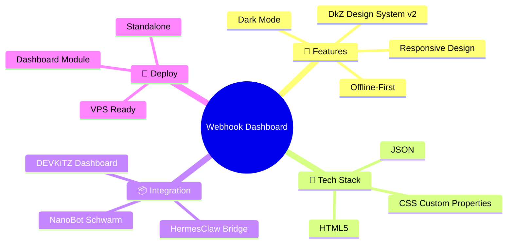
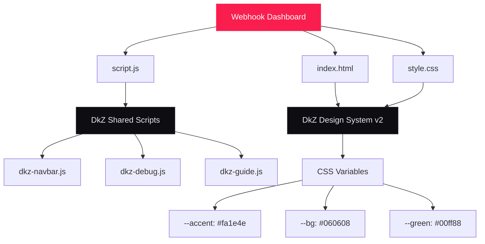

<div align="center">

# ⚡ Webhook Dashboard

### Webhook Dashboard — DkZ

**Part of the [DEVKiTZ™ Ecosystem](https://github.com/7IKED/devkitz-workspace)**


</div>

---

## 🗺️ Mindmap



---

## 📊 Infografik

| Metrik | Wert |
|:-------|:-----|
| 📁 **Dateien** | 3 |
| 📝 **Code-Zeilen** | 216 |
| 🏷️ **Kategorie** | Dashboard & UI |
| 🔧 **Tech Stack** | HTML5, JSON |
| 🎨 **Design System** | DkZ v2 (Glassmorphism) |
| 🌗 **Dark Mode** | ✅ |
| 📱 **Responsive** | ✅ |
| 🔌 **Offline-First** | ✅ |

---

## 🏗️ Architektur



---

## 🚀 Quick Start

```bash
# Clone
git clone https://github.com/7IKED/dkz-webhook-dashboard.git

# Oeffnen
cd dkz-webhook-dashboard
# Einfach index.html im Browser oeffnen
start index.html

# Oder als DEVKiTZ Module
# Kopiere den Ordner nach modules/ im Dashboard
```

---

## 🎨 Design System

Dieses Modul nutzt das **DkZ Design System v2**:

| Variable | Wert | Verwendung |
|:---------|:-----|:-----------|
| `--accent` | `#fa1e4e` | Primaerfarbe, Buttons, Links |
| `--bg` | `#060608` | Hintergrund |
| `--green` | `#00ff88` | Erfolg, Online-Status |
| `--yellow` | `#ffb800` | Warnungen |
| `--red` | `#ff3b5c` | Fehler |

**Fonts:** Inter (UI) · JetBrains Mono (Code)

---

## 📦 DEVKiTZ™ Ecosystem

> Teil des **DEVKiTZ™ AI Developer Ecosystem** mit 150+ Vanilla JS Modulen.

- 🌐 [devkitz-workspace](https://github.com/7IKED/devkitz-workspace) — Haupt-Repository
- 💬 [dkz-chat](https://github.com/7IKED/dkz-chat) — RAG Chat v2
- 🖥️ [dkz-copilot-desktop](https://github.com/7IKED/dkz-copilot-desktop) — Electron Copilot
- 🗣️ [tts-studio](https://github.com/7IKED/tts-studio) — Text-to-Speech
- 🌍 [dkz-translate](https://github.com/7IKED/dkz-translate) — Uebersetzer

---

## 📄 Lizenz

MIT © [7IKED](https://github.com/7IKED) — DEVKiTZ™ 2026
